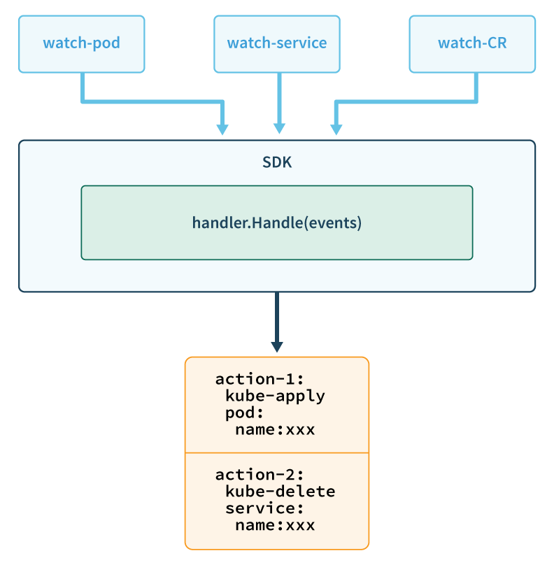

# Operator SDK

### Project Status: pre-alpha

The project is currently pre-alpha and it is expected that breaking changes to the API will be made in the upcoming releases.

See the [design docs][design_docs] for planned work on upcoming milestones:
- [Query API](doc/design/milestone-0.0.2/query-api.md)
- [Action API](doc/design/milestone-0.0.2/action-api.md)

## Overview

[Operators][operator_link] make it easy to manage complex stateful applications on top of Kuberentes. However writing an operator today can be a significant effort that involves challenges like using low level APIs, writing boilerplate, and a lack of modularity which leads to duplication.

The Operator SDK is a framework designed to make writing operators easier by providing:
- High level APIs and abstractions to write the operational logic more intuitively
- Tools for scaffolding and code generation to bootstrap a new project fast
- Modular functionality to improve reusability

## Workflow

The SDK provides the following workflow to develop a new operator:
1. Create a new operator project using the SDK Command Line Interface(CLI)
2. Define new resource APIs by adding CRDs and specifying fields
3. Specify resources to watch using the SDK API
4. Define the operator reconciling logic in a designated handler and use the SDK API to interact with resources
5. Use the SDK CLI to build and generate the operator deployment manifests

At a high level the architecture of an operator using the SDK looks as shown below. The operator processes events for watched resources in a user defined handler and takes actions to reconcile the state of the application.

<p align="center">
	
</p>

# Getting Started

This guide is designed for beginners who want to start an operator project from scratch.

## Guide prerequisites

Before creating any project, this guide has the following prerequisites:

- [dep][dep_tool] version v0.4.1+.
- [go][go_tool] version v1.10+.
- [docker][docker_tool] version 17.03+.
  This guide uses image repository `quay.io/example/memcached-operator` as an example.
- [kubectl][kubectl_tool] version v1.9.0+.
- (optional) [minikube][minikube_tool] version v0.25.0+.
  This guide uses minikube as a quickstart Kubernetes playground. Run the command:
  ```
  minikube start
  ```
  This will start minikube in the background and set up kubectl configuration accordingly.

## Installing Operator SDK CLI

Operator SDK CLI tool is used to manage development lifecycle.

Checkout the desired release tag and install the SDK CLI tool:
```
git checkout tags/v0.0.1
go install github.com/coreos/operator-sdk/commands/operator-sdk
```

## Creating a new project

Operator SDK comes with a number of code generators that are designed to facilitate development lifecycle. It helps create the project scaffolding, preprocess custom resource API to generate Kubernetes related code, generate deployment scripts -- just everything that is necessary to build an operator.

Navigate to `$GOPATH/src/github.com/example-inc/`.

To start a project, we use the `new` generator to provide the foundation of a fresh operator project. Run the following command:

```
operator-sdk new memcached-operator --api-version=cache.example.com/v1alpha1 --kind=Memcached
```

This generates a project repo `memcached-operator`, a custom resource with APIVersion `cache.example.com/v1apha1` and Kind `Memcached`, and an example operator that watches all deployments in the same namespace and logs deployment names.

Navigate to the project folder:

```
cd memcached-operator
```

More details about the structure of the project can be found in [this doc][scaffold_doc].

## Up and running

At this step we actually have a functional operator already.

The default operator behaviour as seen in the entrypoint `cmd/memcached-operator/main.go` is to watch for Deployments in the default namespace and print out their names.

> Note: This example watches Deployments for the APIVersion `apps/v1` which is only present in k8s versions 1.9+. So for k8s versions < 1.9 change the APIVersion to something that is supported e.g `apps/v1beta1`.

To see it, first build the memcached-operator container and then push it to a public registry:
 
```
operator-sdk build quay.io/example/memcached-operator:v0.0.1
docker push quay.io/example/memcached-operator:v0.0.1
```

Kubernetes deployment manifests are generated in `deploy/operator.yaml`. The deployment image is set to the container image specified above.

Deploy memcached-operator:

```
kubectl create -f deploy/rbac.yaml
kubectl create -f deploy/operator.yaml
```

The memcached-operator would be up and running:

```
$ kubectl get deploy
NAME                     DESIRED   CURRENT   UP-TO-DATE   AVAILABLE   AGE
memcached-operator       1         1         1            1           1m
```

Check memcached-operator pod’s log:

```
$ kubectl get pod | grep memcached-operator | cut -d' ' -f1 | xargs kubectl logs
Received Deployment: memcached-operator
```

Clean up resources:

```
kubectl delete -f deploy/operator.yaml
```

This is a basic test that verifies everything works correctly. Next we are going to write the business logic and do something more interesting.


## Customizing operator logic

An operator is used to extend the kube-API and codify application domain knowledge. Operator SDK is designed to provide non-Kubernetes developers an easy way to write the business logic.

In the following steps we are adding a custom resource `Memcached`, and customizing the operator logic that creating a new Memcached CR will create a Memcached Deployment and (optional) Service.

In `pkg/apis/cache/v1alpha1/types.go`, add to `MemcachedSpec` a new field `WithService`:

```Go
type MemcachedSpec struct {
  WithService bool `json:"withService"`
}
```

Re-render the generated code for custom resource:

```
operator-sdk generate k8s
```

In `cmd/memcached-operator/main.go`, modify `sdk.Watch` to watch on `Memcached` custom resource:

```Go
func main() {
  sdk.Watch("cache.example.com/v1alpha1", "Memcached", "default")
  sdk.Handle(stub.NewHandler())
  sdk.Run(context.TODO())
}
```

In `pkg/stub/handler.go`, modify `Handle()` to create a `Memcached` Deployment and an (optional) Service:

```Go
import (
	v1alpha1 "github.com/example-inc/memcached-operator/pkg/apis/cache/v1alpha1"

	"github.com/coreos/operator-sdk/pkg/sdk/action"
	"github.com/coreos/operator-sdk/pkg/sdk/handler"
	"github.com/coreos/operator-sdk/pkg/sdk/types"
	"github.com/sirupsen/logrus"
	apps_v1 "k8s.io/api/apps/v1"
	"k8s.io/api/core/v1"
	metav1 "k8s.io/apimachinery/pkg/apis/meta/v1"
)

func (h *Handler) Handle(ctx types.Context, event types.Event) []types.Action {
	var actions []types.Action
	switch obj := event.Object.(type) {
	case *v1alpha1.Memcached:
		logrus.Infof("Received Memcached: %v", obj.Name)
		ls := map[string]string{
			"app":  "memcached",
			"name": obj.Name,
		}
		ns := "default"
		d := &apps_v1.Deployment{
			TypeMeta: metav1.TypeMeta{
				APIVersion: "apps/v1",
				Kind:       "Deployment",
			},
			ObjectMeta: metav1.ObjectMeta{
				Name:      obj.Name,
				Namespace: ns,
			},
			Spec: apps_v1.DeploymentSpec{
				Selector: &metav1.LabelSelector{
					MatchLabels: ls,
				},
				Template: v1.PodTemplateSpec{
					ObjectMeta: metav1.ObjectMeta{
						Labels: ls,
					},
					Spec: v1.PodSpec{
						Containers: []v1.Container{{
							Image:   "memcached:1.4.36-alpine",
							Name:    "memcached",
							Command: []string{"memcached", "-m=64", "-o", "modern", "-v"},
							Ports: []v1.ContainerPort{{
								ContainerPort: 11211,
								Name:          "memcached",
							}},
						}},
					},
				},
			},
		}
		logrus.Infof("Creating Deployment: %v", obj.Name)
		actions = append(actions, types.Action{
			Object: d,
			Func:   action.KubeApplyFunc,
		})

		if !obj.Spec.WithService {
			break
		}

		svc := &v1.Service{
			TypeMeta: metav1.TypeMeta{
				APIVersion: "v1",
				Kind:       "Service",
			},
			ObjectMeta: metav1.ObjectMeta{
				Name:      obj.Name,
				Namespace: ns,
			},
			Spec: v1.ServiceSpec{
				Selector: ls,
				Ports: []v1.ServicePort{{
					Port: 11211,
					Name: "memcached",
				}},
			},
		}
		logrus.Infof("Creating Service: %v", obj.Name)
		actions = append(actions, types.Action{
			Object: svc,
			Func:   action.KubeApplyFunc,
		})
	}
	return actions
}
```

Rebuild the container:

```
operator-sdk build quay.io/example/memcached-operator:v0.0.2
docker push quay.io/example/memcached-operator:v0.0.2
```

Deploy operator:
```
kubectl create -f deploy/operator.yaml
```

Create a `Memcached` custom resource with the following spec:

```yaml
apiVersion: "cache.example.com/v1alpha1"
kind: "Memcached"
metadata:
  name: "example"
spec:
  withService: true
```

There will be a new Memcached Deployment:
```
$ kubectl get deploy
example
```

There will be a new Memcached Service:
```
$ kubectl get service
example
```

We can test the Memcached service by opening a telnet session and running commands via [Memcached protocols][mc_protocol]:

1. Open a telnet session in another pod in order to talk to the service:
   ```
   kubectl run -it --rm busybox --image=busybox --restart=Never -- telnet example 11211
   ```
2. In the telnet prompt, enter the following commands to set a key:
   ```
   set foo 0 0 3
   bar
   ```
3. Enter the following command to get the key:
   ```
   get foo
   ```
   It should output:
   ```
   VALUE foo 0 3
   bar
   ```

Now we have successfully customized the event handling logic to deploy a Memcached service for us.

Clean up the resources:

```
kubectl delete memcached example
kubectl delete -f deploy/operator.yaml
kubectl delete deployment/example service/example
```

[scaffold_doc]:./doc/project_layout.md
[mc_protocol]:https://github.com/memcached/memcached/blob/master/doc/protocol.txt
[dep_tool]:https://golang.github.io/dep/docs/installation.html
[go_tool]:https://golang.org/dl/
[docker_tool]:https://docs.docker.com/install/
[kubectl_tool]:https://kubernetes.io/docs/tasks/tools/install-kubectl/
[minikube_tool]:https://github.com/kubernetes/minikube#installation
[operator_link]:https://coreos.com/operators/
[design_docs]:./doc/design
