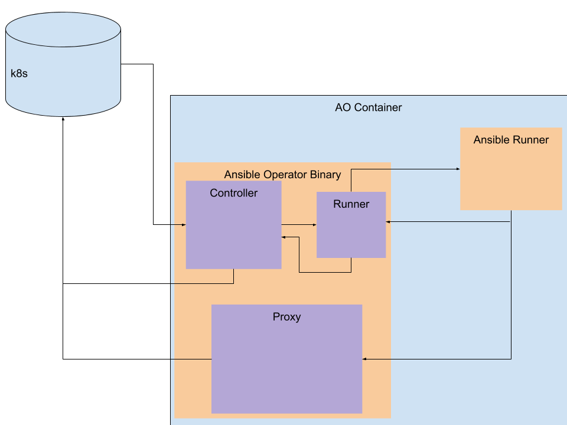

# Information Flow for Ansible Operator

### Controller/Reconciler
 * Gets the primary resource based on NamespacedName this uses the cache from controller runtime.
 * Determines if the resource is deleted based on the existence of a finalizer and a metadata.DeletionTimeStamp.
   * If deleted and not one of our finalizers we exit with no error.
   * If finalizer is needed, but is not on the object, and is not deleted then add it and continue.
 * Marks the status of the CR as running if it is managing the status and continues
 * Creates the proxy’s kubeconfig.
 * Calls out Runner using the runner package.
 * Watches for events to come back across the results channel.
   * Logs the events
   * Keeps track of failure messages as well as the StatusEvent, which is the ending event that the Ansible sends to mark the playbook/role is completed.
 * If a finalizer exists and the resource was deleted then remove the finalizer and update the object and continue.
 * Update the status of the resource to mark that the run has completed

### Runner Package
 * Create the socket that ansible will communicate over
 * Translate object.Spec -> ansible vars (camelCase -> camel_case) and adds them as parameters for the ansible-runner directory.
 * Create the directory on disk for ansible runner. or update the files on disk if they already exist.
 * Run the ansible runner command in a go routine, when this exits close the channel for the socket.

### The Proxy
 * Every request to the k8s api goes through the proxy.
 * The owner reference is injected into the object that is being created.
 * The proxy then adds dependent watches for the correct controller if we have not started watching the type already
 * On a GET, we attempt to use the informer cache to get the resource. This will also attempt to re-add dependent watches if we find a type with an owner reference.

### Ansible Runner
 * Ansible is run and has its own process.
 * Ansible-runner-http package allows runner to set us ansible events as ansible is being run. ansible runner uses the socket and the controller is watching the events as they come through the channel.

