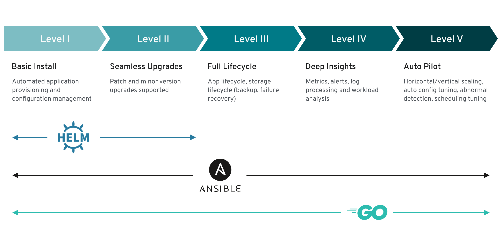

# Operator Capability Levels

Operators come in different maturity levels in regards to their lifecycle management capabilities for the application or workload they deliver. The capability models aims to provide guidance in terminology to express what features users can expect from an operator.

Each capability level is associated with a certain set of management features the Operator offers around the managed workload. Operator that do not manage a workload and/or are delegating to off-clusters orchestration services would remain at Level 1. Capability levels are accumulating, i.e. Level 3 capabilities require all capabilities desired from Level 1 and 2.

## Terminology

**Operator** - the custom controller installed on a Kubernetes cluster

**Operand** - the managed workload provided by the Operator as a service

**Custom Resource (CR)** - an instance of the [`CustomResourceDefinition`](https://kubernetes.io/docs/tasks/access-kubernetes-api/custom-resources/custom-resource-definitions/) the Operator ships that represents the Operand or an Operation on an Operand (also known as primary resources)

**Managed resources** - the Kubernetes objects or off-cluster services the Operator uses to constitute an Operand (also known as secodary resources)

**Custom Resource Definition (CRD)** - an API of the Operator, providing the blueprint and validation rules for **Custom Resources**.

---

## Level 1 - Basic Install

The Operator offers the following basic features:

**Installation of the workload**

- Operator deploys an Operand or configures off-cluster resources
- Operator waits for managed resources to reach a healthy state
- Operator conveys readiness of application or managed resources to the user leveraging the `status` block of the Custom Resource

**Example:** an Operator deploys a database by creating `Deployment`, `ServiceAccount`, `RoleBinding`, `ConfigMap`, `PersistentVolumeClaim` and `Secret` object, initializes an empty database schema and signals readiness of the database to accept queries.

**Configuration of the workload**

- Operator provides configuration via the `spec` section of the Custom Resource
- Operator reconciles configuration and updates to it with the status of the managed resources

**Example:** an Operator, managing a database, offers increasing the capacity of the database by resizing the underlying `PersistentVolumeClaim` based on changes the databases Custom Resource instance.

**Guiding questions to determine Operator reaching Level 1**

1. What installation configuration can be set in the CR?

2. What additional installation configuration could still be added?

3. Can you set operand configuration in the CR? If so, what configuration is supported for each operand?

4. Does the managed application / workload get updated in a non-disruptive fashion when the configuration of the CR is changed?

5. Does the status of the CR reflect that configuration changes are currently applied?

6. What additional operand configuration could still be added?

7. Do all of the instantiated CRs include a status block? If so, does it provide enough insight to the user about the application state?

8. Do all of your CRs have documentation listing valid values and mandatory fields?

---

## Level 2 - Seamless Upgrades

The Operator offers the following features related to upgrades:

**Upgrade of the managed workload**

- Operand can be upgraded in the process of upgrading the Operator, or
- Operand can be upgraded as part of changing the CR
- Operator understands how to upgrade older versions of the Operand, managed previously by an older version of the Operator

**Upgrade of the Operator**

- Operator can be upgraded seamlessly and can either still manage older versions of the Operand or update them
- Operator conveys inability to manage an unsupported version of the Operand in the `status` section of the CR

**Example:** An Operator managing a database can update an existing database from a previous to a newer version without data loss. The Operator might do so as part of a configuration change or as part of an update of the Operator itself.

**Guiding questions to determine Operator reaching Level 2**

1. Can your Operator upgrade your Operand?

2. Does your Operator upgrade your Operand during updates of the Operator?

3. Can your Operator manage older Operand version versions?

4. Is the Operand upgrade potentially disruptive?

5. If there is downtime during an upgrade, does the Operator convey this in the `status` of the CR?

---

## Level 3 - Full Lifecycle

The Operator offers one or more of the following lifecycle management features:

**Lifecycle features**

- Operator provides the ability to create backups of the Operand
- Operator is able to restore a backup of an Operand
- Operator orchestrates complex re-configuration flows on the Operand
- Operator implements fail-over and fail-back of clustered Operands
- Operator supports add/removing members to a clustered Operand
- Operator enables application-aware scaling of the Operand

**Example:** an Operator managing a database provides the ability to create an application consistent backup of the data by flushing the database log and quiescing the write activity to the database files.

**Guiding questions to determine Operator reaching Level 3**

1. Does your Operator support backing up the Operand?

2. Does your Operator support restoring an Operand from a backup and get it under management again?

3. Does your Operator wait for reconfiguration work to be finished and in the expected sequence?

4. Is your Operator taking cluster quorum into account, if present?

5. Does your Operator allow adding/removing read-only slave instances of your Operator?

---

## Level 4 - Deep Insights

**Monitoring**

- Operator exposing metrics about its health
- Operator exposes health and performance metrics about the Operand

**Alerting and Events**

- Operand sends useful alerts 1
- Custom Resources emit custom events 2

**Metering**

- Operator leverages Operator Metering

1 Aim to have as few alerts as possible, by alerting on symptoms that are associated with end-user pain rather than trying to catch every possible way that pain could be caused. Alerts should link to relevant consoles and make it easy to figure out which component is at fault

2 Native k8s objects emit events (“Events” objects) as their states change. Your operator should do similar for state changes related to your operand. “Custom”, here, means that it should emit events specific to your operator/operand outside of the events already emitted by their deployment methodology.  This, in conjunction with status descriptors, give much needed visibility into actions taken by your operator/operand. Operators are codified domain-specific knowledge. Your end user should not need this domain-specific knowledge to gain visibility into what’s happening with their resource.

**Example:** A database Operator continues to parse the logging output of the database software and understands noteworthy log events, e.g. running out of space for database files and produces alerts. The operator also instruments the database and exposes application level, e.g. database queries per second

**Guiding questions to determine Operator reaching Level 4**

1. Does your Operator expose a health metrics endpoint?

2. Does your Operator expose Operand alerts?

3. Does your Operator watch the Operand to create alerts?

4. Does your Operator emit custom Kubernetes events?

5. Does your Operator expose Operand performance metrics?

---

## Level 5 - Auto Pilot

**Auto-scaling**

- Operator scales the Operand up under increased load based on Operand metric
- Operator scales the Operand down below a certain load based on Operand metric

**Auto-Healing**

- Operator can automatically heal unhealthy Operands based on Operand metrics/alerts/logs
- Operator can prevent the Operand from transitioning into an unhealthy state based on Operand metrics

**Auto-tuning**

- Operator is able to automatically tune the Operand to a certain workload pattern
- Operator dynamically shifts workloads onto best suited nodes

**Abnormality detection**

- Operator determines deviations from a standard performance profile

**Example:** A database operator monitors the query load of the database and automatically scales additional read-only slave replicas up and down. The operator also detects subpar index performance and automatically rebuilds the index in times of reduced load. Further, the operator understands the normal performance profile of the database and creates alerts on excessive amount of slow queries. In the event of slow queries and high disk latency the Operator automatically transitions the database files to another `PersistentVolume` of a higher performance class.

**Guiding questions to determine Operator reaching Level 5**

1. Can your operator read metrics such as requests per second or other relevant metrics and auto-scale horizontally or vertically, i.e., increasing the number of pods or  resources used by pods?

2. Based on question number 1 can it scale down or decrease the number of pods or the total amount of resources used by pods?

3. Based on the deep insights built upon level 4 capabilities can your operator determine when an operand became unhealthy and take action such as redeploying, changing configurations, restoring backups etc.?

3. Again considering that with level 4 deep insights the operator has information to learn the performance baseline dynamically and can learn the best configurations for peak performance can it adjust the configurations to do so?

4. Can it move the workloads to better nodes, storage or networks to do so?

5. Can it detect and alert when anything is working below the learned performance baseline that can’t be corrected automatically?
